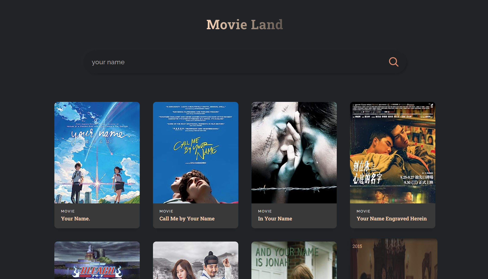

# MovieLand

**"Movie Land"** is a React-based web application that allows users to search for and explore information about movies as well as different television series. It features a user-friendly interface for searching TV shows, and each show is presented with its title, year, poster, and type. The project leverages the OMDB API to fetch movie data and provides an engaging way to discover and learn about various films.

<p align="center">
  
</p>

## Features

- Search for movies by title.
- Display movie details, including title, year, poster, and type.
- User-friendly interface for a seamless movie search experience.

## Getting Started

To get started with the **"Movie Land"** project, follow these steps:

1. Clone the repository to your local machine.

   ```bash
   git clone <repository-url>

2. Install the required dependencies.

   ```bash
   cd movie-land
   npm install

3. Start the development server.
  
     ```bash
     npm start
      ```
   
## Dependencies  
- React
- OMDB API

